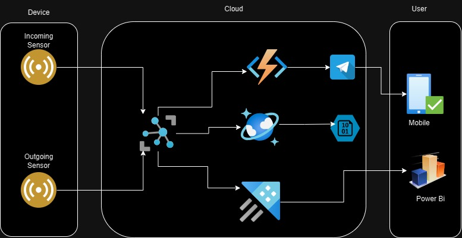
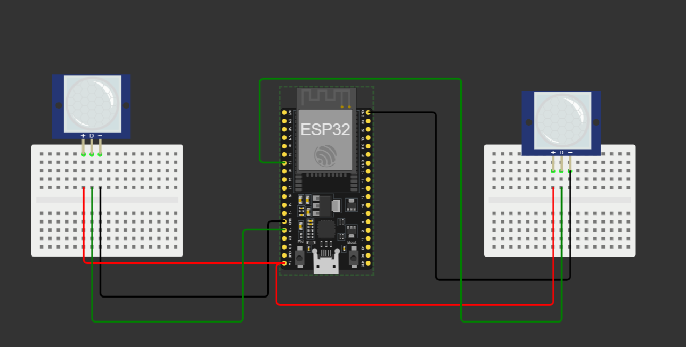
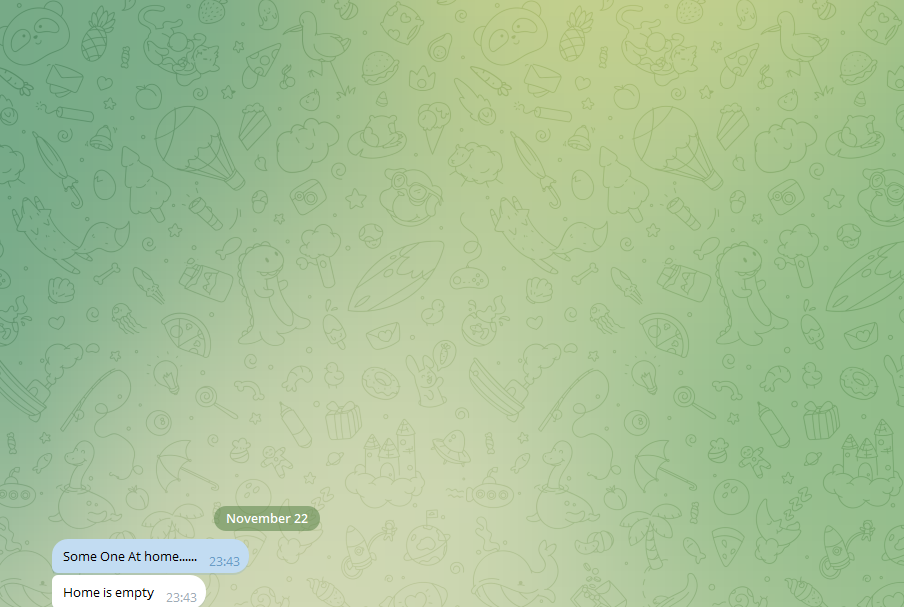
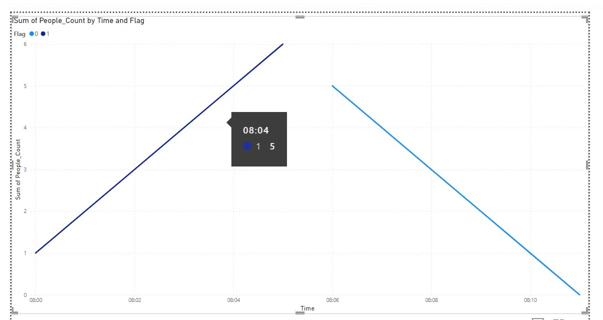

# Smart_Home_Monitoring_System_With_Azure
 
This project aims to design and implement a Smart Home Security and Monitoring System leveraging the capabilities of Azure IoT. The system utilizes an ESP32 microcontroller connected to Azure IoT Hub via the MQTT protocol. Motion sensors ("In" and "Out") are employed to track entries and exits from the home. The data is stored in Azure Cosmos DB for future analysis. An Azure Function App, triggered by Event Grid, is responsible for processing the data and sending real-time notifications to users via a Telegram bot.

## System Architecture  


In this project system has different layers

1. Device Layer  
2. Communication Layer
3. Cloud Service Layer
4. Processing and Notification Layer

## Device Layer


___ESP32 Microcontroller:___ Acts as the primary device layer, responsible for collecting data from motion sensors ("In" and "Out").  
___Motion Sensors ("In" and "Out"):___ Capture entry and exit events, respectively, providing input to the ESP32. Two motion sensors, "In" (connected to GPIO pin 13) and "Out" (connected to GPIO pin 32), are used to detect entries and exits.
```cpp  
void activeOutsensor(int data){  
  if(data==1){
    digitalWrite(INSENSOR,HIGH);
    personCount++;
    flag_status=0;
    Serial.print("People Comming In Total people at home are:");
    Serial.println(personCount);
    if(personCount==1 && flag_status==0){
      Serial.println("Someone at home....");
    }
    sendTelemetry();
    delay(2000);
  }   
}
void activeInsensor(int data){
  if(data==0){
    digitalWrite(OUTSENSOR,LOW);
    personCount--;
    if(personCount<0){
     personCount=0;
     flag_status=0;
    }
    else{
    flag_status=1;
    Serial.print("People Going Out Total people at home are:");
    Serial.println(personCount);
    }
    if(personCount==0 && flag_status==1){
    
    Serial.println("Home is empty");
    }
    if(personCount>=0 && flag_status==1){
      sendTelemetry();
    }  
    delay(2000);   
  }
}

```

In the code activeOutsensor and activeInsensor these 2 functions are responsible for get "In" and "Out" data and send those data to the Azure IoT hub.

## Communication Layer
___MQTT Protocol:___ Facilitates lightweight and reliable communication between the ESP32 microcontroller and Azure IoT Hub.  
___Azure IoT Hub:___ Serves as the central hub for device-to-cloud communication, receiving data from the ESP32 and ensuring secure and scalable connectivity.  
## Cloud Services Layer
___Azure Cosmos DB:___ The NoSQL database stores the incoming data for future analysis. Its scalability and low-latency retrieval make it ideal for handling real-time data. It saves data as Json formate.  
___Event Grid:___ Triggers the Azure Function App in response to data events in Azure IoT Hub, ensuring immediate processing and action.  
___Azure Data Explorer:___ Azure Data Explorer (ADX) is a real-time data exploration service on Microsoft Azure. It's designed for analyzing large and diverse datasets quickly. Key features include seamless data ingestion from IoT Hub, a schema-less data model, a powerful query language called Kusto Query Language (KQL), and integration with other Azure services. ADX excels in real-time analytics, making it suitable for scenarios like log and telemetry analysis. It offers robust security, scalability, and management tools for efficient data processing.
## Processing and Notification Layer  
___Azure Function App:___  
```python
telegramBotAPI="telegram token"
Receivers_id="chat id"

def SendMessege(message):
    try:
        Url="https://api.telegram.org/bot"+str(telegramBotAPI)+"/sendMessage?chat_id="+str(Receivers_id)
        textdata={"text":message}
        requests.request("POST",Url,params=textdata)
    except Exception as e:
        Message = str(e)+":Exception  in send message "
        print(Message)

def main(event: func.EventGridEvent):
    logging.info("startin script")     
    result = json.dumps({
        'id': event.id,
        'data': event.get_json(),
        'topic': event.topic,
        'subject': event.subject,
        'event_type': event.event_type,
    })    
    result_dict = json.loads(result)   
    
    flag= result_dict['data']['body']['Flag']
    people_count=result_dict['data']['body']['People_Count']     
    
    if flag==0 and people_count==1:
        SendMessege("Some One At home......")
    elif flag==1 and people_count==0:
        SendMessege("Home is empty")   
         
    logging.info('Python EventGrid trigger processed an event: %s', result)

```  
 Processes incoming data, calculating and updating the person count based on "In" and "Out" sensor activations.It also process Flag value which means which sensor it is "In" sensor or "out" sensor.  
___Telegram Bot:___ Sends real-time notifications to users based on the person count. Messages include "SOMEONE AT HOME" when the count is 1 and "HOME IS EMPTY" when the count reaches 0.  
 

___visualization:___ 
    For visualization I am using Power Bi as output device. I am collecting data from Azure Data Explorer and export them to the power Bi and presenting as a Graph.

## Security:

___Azure IoT Security:___ Ensures secure communication between devices and Azure IoT Hub. When I connect my device to the Azure IoT Hub I used Azure device Id and Connection Key which gives me a secure way to connect my device to Azure. Adheres to Azure IoT security measures for data integrity and privacy.  
___Cosmos DB Security:___ Utilizes Cosmos DB security features for safeguarding stored data. Implements measures to ensure data integrity and protect user privacy.  
___Telegram Bot Security:___ Implements secure communication protocols for Telegram bot. I used token which gives me a secure way to access my Telegram Bot. Ensures the confidentiality and integrity of user notifications.  
 